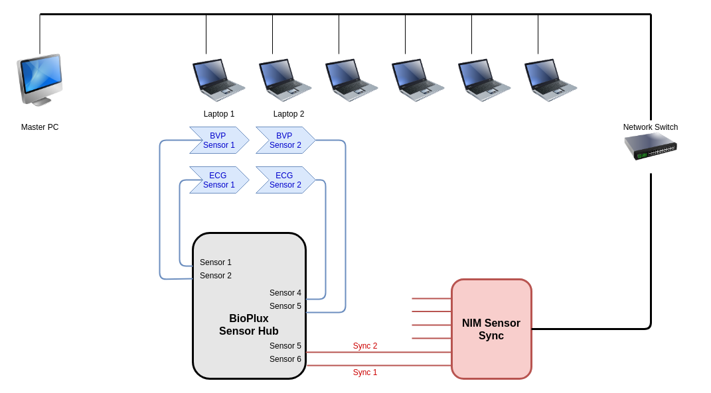

# NIM Technology Lab Sensor Sync API

<!-- vim-markdown-toc GFM -->

* [0. Introduction](#0-introduction)
* [1. Configuring the device](#1-configuring-the-device)
    * [1.1 Restoring the default configuration](#11-restoring-the-default-configuration)
* [2. APIs](#2-apis)
* [2.1 Python API](#21-python-api)
    * [2.1.1 Prerequisites](#211-prerequisites)
        * [2.1.1.1 The pipenv way](#2111-the-pipenv-way)
        * [2.1.1.2 Without pipenv](#2112-without-pipenv)
    * [2.1.2 Examples](#212-examples)
* [2.2 Python API (type-checked)](#22-python-api-type-checked)
    * [2.2.1 Prerequisites](#221-prerequisites)
    * [2.2.2 Examples](#222-examples)
* [2.3 Javascript API](#23-javascript-api)
    * [2.3.1 Examples](#231-examples)

<!-- vim-markdown-toc -->

## 0. Introduction


The NIM Sensor Sync device was designed to enable easy real-time synchronization of sensor data and lab experiment
(online) software. This is necessary since sensor data capturing devices or software and the experiment software can run
on different systems and produce separate data streams. An online experiment might produce a .CSV file or log file on
the web server - whereas the sensor capturing software might run on a proband-facing laptop in the lab, producing a
different CSV file. Synchronizing these two data streams: from the experiment software and from the sensor data
capturing software is essential for correlation of sensor data to events during a lab experiment. 

The NIM Sensor Sync provides electrical sensor interfaces that can be controlled over the network via HTTP.  Sensor
capturing devices such as a biosignalsplux sensor hub can capture the state of these networked sensor outputs that in
turn are controlled by the experiment software via an easy HTTP API. 

Using the networked sensor outputs, the experiment software can send synchronization pulses to the sensor capturing
device. That way, it can place marks in the sensor data - e.g. when a proband started interacting with the experiment
software, pressed a certain button, started watching a video, etc. 

One NIM Sensor Sync device provides 8 networked sensor outputs. The following illustration shows an exemplary setup,
where two lab seats are equipped with a laptop and two different sensors each. All sensors are connected to a 6-channel
sensor hub. For synchronization, two inputs of the sensor hub - one for each proband laptop - are connected to the NIM
Sensor Sync's sensor outputs. The Sensor Sync device is connected to the Ethernet network, as are all proband laptops
and the master PC for the experiment administrator. In this scenario, sensor data synchronization "mark" requests can be
sent either by the web server running the experiment backend on the master PC or by the web browsers of the proband
laptops during the experiment. 



## 1. Configuring the device

Use [the configuration tool](./sample.html). You can run it by opening it ([sample.html](sample.html)) in a browser, no
HTTP server required.

This tool allows you to:

- configure a connected device's IP address
- configure a connected device's MAC address
- reboot a connected device -> IP and MAC changes take effect
- read current config (including sensor states)
- change sensor states (outputs)

### 1.1 Restoring the default configuration
The default configuration:

- IP: `192.168.2.49`
- MAC: `CA.FE.EE.CA.FE.ED`

These defaults are restored when you:
- power up the device
- within 5 seconds,
  - hold the button for 3 seconds
- _(as an indicator that the default config was restored, the LED light will deactivate)_
- reboot (power cycle) the device

## 2. APIs

## 2.1 Python API 

See [python/](python/)

### 2.1.1 Prerequisites

#### 2.1.1.1 The pipenv way
The API supports [pipenv](https://pipenv.pypa.io). Install pipenv by running:

```console
pip install --user pipenv
```

To install dependencies, run:

```console
$ pipenv install
```

Then, to run `ssync.py`, which tests all API functions against a device using the [default
configuration](#11-restoring-the-default-configuration), run the following:

```console
$ pipenv run python ssync.py
```

Please note that instead of prefixing every command with `pipenv run`, you can alternatively also open a pipenv shell:

```console
$ pipenv shell
```

#### 2.1.1.2 Without pipenv

Ensure you are running python 3.8 or above. Then run:

```console
$ pip install requests
```

Then, to run `ssync.py`, which tests all API functions against a device using the [default
configuration](#11-restoring-the-default-configuration), run the following:

```console
$ python ssync.py
```


### 2.1.2 Examples

```python
    # import and init
    import SensorSync from ssync
    s = SensorSync('192.168.2.49')

    # or
    # s = SensorSync()
    # s.ip = '192.168.2.49'


    # set and reset sensors
    # valid sensor numbers: 1..8
    OK, _ = s.activate(1)
    OK, _ = s.reset(1)

    # optionally, check the returned html when activating/resetting:
    OK, _ = s.activate(1, verify=True)
    OK, _ = s.reset(1, verify=True)

    # request status
    OK, status_html = s.status()

    # status_html looks like this:
        <html>
        Version 2.3
        IP=192.168.2.49
        MAC=DE.AD.BE.EF.FE.ED
        SENSORS=0
        </html>

    # re-configure device:
    OK, _ = s.write_ip('192.168.2.49')
    OK, _ = s.write_mac('CA.FE.EE.CA.FE.ED')
    OK, _ = s.reboot()
```

## 2.2 Python API (type-checked)

### 2.2.1 Prerequisites

Optionally, a type-checked version of the API exists. It lives in
[./python/type_checked_python_3.9_and_above](./python/type_checked_python_3.9_and_above/).

**The type-checked API requires python 3.9 or above!**

Its dependencies are:
- `python3.9` or above
- `requests` : runtime only
- `mypy` : type-checker, development time only
- `types-requests` : development time only

So, if you just want to use the API, you only need to `pip install requests` and you are done.

If you plan to develop and use `mypy` for type-checking, we recommend using [pipenv](https://pipenv.pypa.io). Install
pipenv by running:

```console
pip install --user pipenv
```

To install dependencies, run:

```console
$ pipenv install -d
```

Then, to run `ssync.py`, which tests all API functions against a device using the [default
configuration](#11-restoring-the-default-configuration), run the following:

```console
$ pipenv run python ssync.py
```

To perform a type-check, run:

```console
$ pipenv run mypy .
```

Please note that instead of prefixing every command with `pipenv run`, you can alternatively also open a pipenv shell:

```console
$ pipenv shell
```

### 2.2.2 Examples

```python
    # import and init
    import SensorSync from ssync
    s = SensorSync('192.168.2.49')

    # or
    # s = SensorSync()
    # s.ip = '192.168.2.49'


    # set and reset sensors
    # valid sensor numbers: 1..8
    OK, _ = s.activate(1)
    OK, _ = s.reset(1)

    # optionally, check the returned html when activating/resetting:
    OK, _ = s.activate(1, verify=True)
    OK, _ = s.reset(1, verify=True)

    # request status
    OK, status_html = s.status()

    # status_html looks like this:
        <html>
        Version 2.3
        IP=192.168.2.49
        MAC=DE.AD.BE.EF.FE.ED
        SENSORS=0
        </html>

    # re-configure device:
    OK, _ = s.write_ip('192.168.2.49')
    OK, _ = s.write_mac('CA.FE.EE.CA.FE.ED')
    OK, _ = s.reboot()
```

## 2.3 Javascript API

See [javascript/](javascript/). A simple demo web page, [ssync-demo.html](javascript/ssync-demo.html), is provided, too.
You can open it directly in the browser, no web server required.

Should your system insist on a web server, there's always:

```console
python3 -m http.server .
```

### 2.3.1 Examples

```javascript
    // set IP address to use:
    // ------------------------------------------------------------------------
    set_ssync_ip(ip_address_as_string);


    // activate a sensor:
    // ------------------------------------------------------------------------
    activate_sensor(sensor_number);    // sensor number range: 1..8


    // de-activate a sensor:
    // ------------------------------------------------------------------------
    reset_sensor(sensor_number);       // sensor number range: 1..8


    // read config:
    // ------------------------------------------------------------------------
    read_config()    // returns a promise, access with .then(...)

    read_config().then(data => console.log(data.ip, data.mac, data.sensors))


    // return values and error handling
    // ------------------------------------------------------------------------
    // just activate
    activate_sensor(1);

    // activate sensor and log result to console
    activate_sensor(1).then(result_html => console.log(result_html));

    // activate sensor and log result to console, catch and log error
    activate_sensor(1)
        .then(result_html => console.log(result_html))
        .catch(function (err) {
            console.log('Fetch Error :-S', err);
        });

    // NOTE: if you chain multiple calls and want them to be executed in order, 
    //       use the `await` keyword.  This only works inside of functions:

    async function foo() {
        console.log('the following happens in order')

        // just activate
        await activate_sensor(1);

        // activate sensor and log result to console
        await activate_sensor(1).then(result_html => console.log(result_html));

        // activate sensor and log result to console, catch and log error
        await activate_sensor(1)
            .then(result_html => console.log(result_html))
            .catch(function (err) {
                console.log('Fetch Error :-S', err);
            });

        await read_config().then(data => console.log('\n',
            'ip: ' + data.ip, '\n',
            'mac: ' + data.mac, '\n',
            'sensor states: ', data.sensors, '\n',
            data)
        );
        
        console.log('finished');
    }

    // call the function
    foo();

    // see `ssync-demo.html` for an example for how to use this inside of an HTML file.
```

